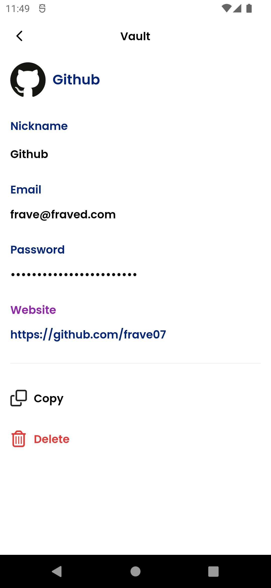
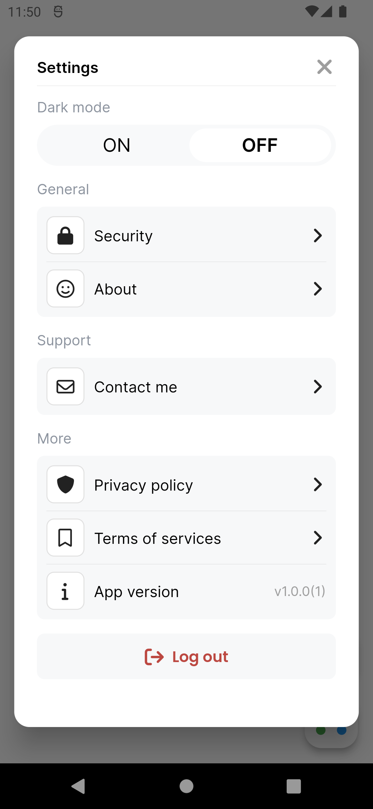

  ###  

  ***FRAVE DEVELOPER***

    SAFE MANAGER - PASSWORD MANAGER

 
<table>
    <tr>
        <th style="text-align:center">
            
        </th>
        <th style="text-align:center">
            
        </th>
        <th style="text-align:center">
            
        </th>
    </tr>
</table>
 

### Screen Initial
- Create Account
- Login
- Delete Account
- Report a bug
- About
- Generate password

### Screen Create Account
- Random number
- Verify Password

### Screen Login
- Random number

### Dashboard
- Filter password browser
- Filter password Applications
- Filter Cards
- Recently Added
- Copy password 
- Search password for name in Browser or Applications

### Screen Security
- Only change pin

### Delete Account
- Verify Password
- Deleted all information

### Packages
- Flutter Bloc
- Hive
- Flutter Secure Storage
- Encrypt
- Card Swiper

### Dark Mode

## Screenshots
---

<table >
    <tr>
        <th style="text-align:center">Screen Initial</th>
        <th style="text-align:center">Screen Initial</th>
        <th style="text-align:center">Screen Login</th>
    </tr>
    <tr>
        <td></td>
        <td></td>
        <td></td>
    </tr>
</table>

<table >
    <tr>
        <th style="text-align:center">Screen Login</th>
        <th style="text-align:center">Screen Dashboard</th>
        <th style="text-align:center">Screen Filter Browser</th>
    </tr>
    <tr>
        <td></td>
        <td></td>
        <td></td>
    </tr>
</table>

<table >
    <tr>
        <th style="text-align:center">Screen Filter Apps</th>
        <th style="text-align:center">Screen Vault</th>
        <th style="text-align:center">Modal Added</th>
    </tr>
    <tr>
        <td></td>
        <td></td>
        <td></td>
    </tr>
</table>

<table >
    <tr>
        <th style="text-align:center">Screen Add Password</th>
        <th style="text-align:center">Screen Generate Password</th>
        <th style="text-align:center">Modal Add Cards</th>
    </tr>
    <tr>
        <td></td>
        <td></td>
        <td></td>
    </tr>
</table>

<table >
    <tr>
        <th style="text-align:center">Screen Cards</th>
        <th style="text-align:center">Screen Cards</th>
        <th style="text-align:center">Settings</th>
    </tr>
    <tr>
        <td></td>
        <td></td>
        <td></td>
    </tr>
</table>

<table>
    <tr>
        <th style="text-align:center">Screen Security</th>
        <th style="text-align:center"></th>
        <th style="text-align:center"></th>
    </tr>
    <tr>
        <td></td>
        <td></td>
        <td></td>
    </tr>
</table>

<table >
    <tr>
        <th style="text-align:center">Screen Report a bug</th>
        <th style="text-align:center">Screen About</th>
        <th style="text-align:center">Screen Delete Account</th>
    </tr>
    <tr>
        <td></td>
        <td></td>
        <td></td>
    </tr>
</table>

<table >
    <tr>
        <th style="text-align:center">Home -dark</th>
        <th style="text-align:center">Setting - dark</th>
        <th style="text-align:center">Add Password - dark</th>
    </tr>
    <tr>
        <td></td>
        <td></td>
        <td></td>
    </tr>
</table>

<table >
    <tr>
        <th style="text-align:center">Notepad - Gridview</th>
        <th style="text-align:center">Notepad - Listview</th>
        <th style="text-align:center">Notepad options</th>
    </tr>
    <tr>
        <td></td>
        <td></td>
        <td></td>
    </tr>
</table>

